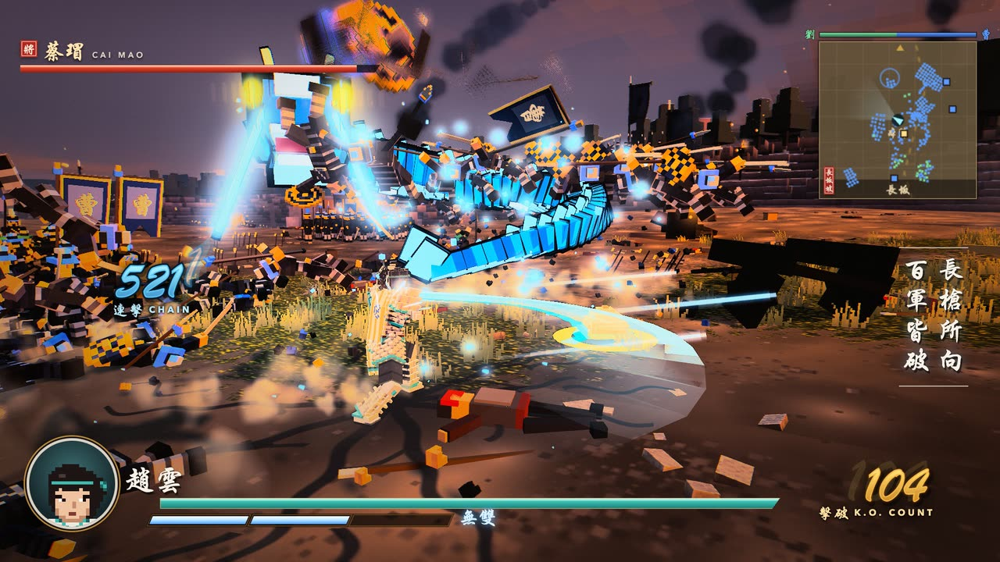
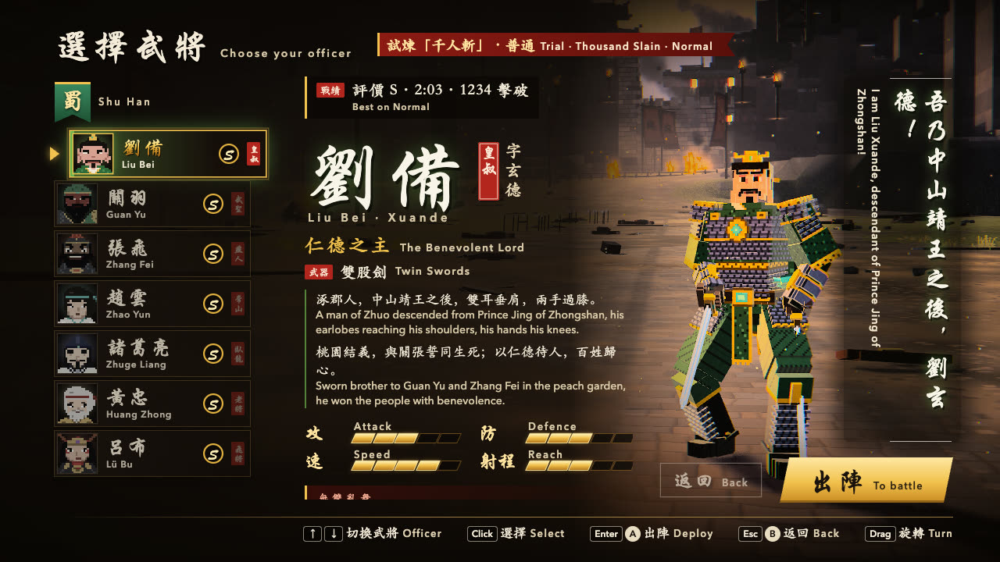
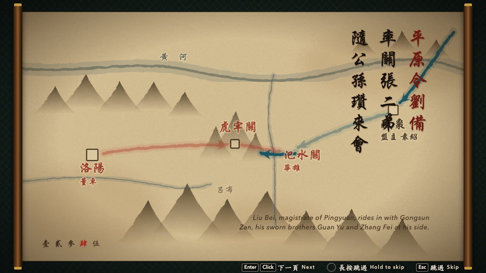
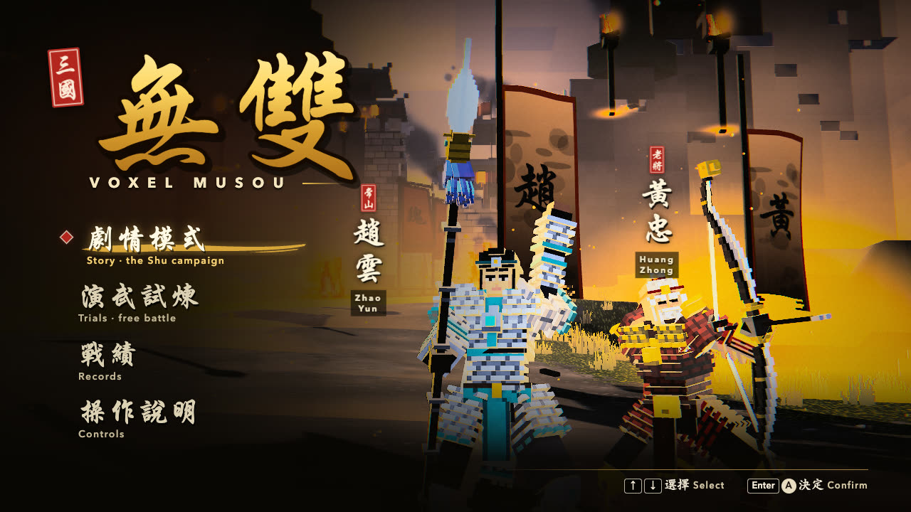

# Voxel Musou

<p align="center">
  <a href="https://voxel-musou.vercel.app"></a>
</p>

<p align="center"><b><a href="https://voxel-musou.vercel.app">▶ Play in your browser — voxel-musou.vercel.app</a></b></p>

| | |
| --- | --- |
|  |  |
| Zhao Yun — spear string through the crowd | Huang Zhong — Musou 百步穿楊, flaming volley |
|  |  |
| Zhao Yun — Musou 蒼龍破陣, the dragon | Huang Zhong — the giant arrow |
|  |  |
| Choose your officer | Chapter I 「定軍山」 prologue |

A browser-playable voxel action game in the style of Dynasty Warriors, built with Three.js. Take the field as Zhao Yun (趙雲) with his spear or Huang Zhong (黃忠) with his great bow, and cut through hundreds of Wei soldiers — in the story chapter at Mount Dingjun or in an endless free battle at Mount Dingjun or the Red Cliffs.

No build step: plain ES modules, Three.js r186 vendored in `vendor/three/`, deterministic fixed 60 Hz simulation.

## Features

- Three playable officers with their own models and Musou:
  - **Zhao Yun** — spear: normal combos (N1–N6), charge attacks (C1–C6), Musou 蒼龍破陣 with a dragon
  - **Huang Zhong** — bow: limb slashes and point-blank shots, charge shots (fan, barrage, arrow rain, fire arrow), aim mode, Musou 百步穿楊 (a flaming volley and a giant arrow)
  - **Guan Yu** (free battle) — 青龍偃月刀 glaive: N1–N3 and C1 of his own (the rest borrowed from Zhao Yun's spear set for now), Musou 青龍偃月・天崩 (a vortex whirlwind that drags the army in, a leap, and a jade crescent falling from the sky to cleave the field)
- Story mode, Chapter I 「定軍山」: prologue, scripted battle with dialogue, objectives, enemy officers and gates, result screen; play it as either officer (the other one joins the dialogue)
- Free battle: endless waves on the battlefield of your choice:
  - **定軍山 Mount Dingjun** — the Han River ford and the mountain pass below the Wei camp
  - **赤壁 Red Cliffs** — the shore under the red sandstone cliffs (赤壁 cut into the face), Cao Cao's chained fleet burning on the Yangtze, piers out to the ships, Cao's naval stockade with its command tower, and Wei officers of the river campaign (曹仁, 張遼, 蔡瑁, 張允)
- Four difficulties, picked after the mode on the title (free battle then asks for the battlefield): 初級 · 普通 · 上級 · 修羅 (修羅 opens once Chapter I is cleared on 上級). Grunts stay one-sweep fodder; the tiers turn enemy pressure, officer toughness and the cost of a hit
- Jump, jump attack, dodge; hit-stop and impact VFX
- Dense voxel crowds of Wei soldiers (~300, InstancedMesh) blasted apart into voxel debris, allied Shu troops
- Enemy officers with name and HP tags
- Golden-hour valley battlefield with a river, camps, castle, fires and banners
- Custom post-processing: atmospheric haze, depth of field, bloom, retro pixel look
- Procedural WebAudio sound
- Calligraphy-style title, character select, HUD and ink-wipe transitions

## Run

ES modules don't load from `file://`, so serve the folder with any static server:

```sh
python3 -m http.server 8000
```

Then open http://localhost:8000 . Requires a WebGL2 browser; a desktop GPU is recommended. Sound starts on the first key press or click.

## Controls

Keyboard and mouse, or a gamepad.

| Action | Keys | Gamepad |
| --- | --- | --- |
| Move (camera-relative) | WASD / arrow keys | left stick |
| Attack | J / left click | X □ |
| Charge | K / right click (mid-combo) | Y △ |
| Jump | Space | A × |
| Dodge | L / Shift | R1 R2 |
| Musou (gauge full) | I | B ○ |
| Camera | mouse (click the field to lock it) / Q E | right stick |
| Recenter / face nearest officer | R | L1 L2 |
| Aim (Huang Zhong) | hold K / right click, release to loose | hold Y △ |
| Pause / controls | Esc | |



## Options

| URL parameter | Description |
| --- | --- |
| `?enemies=N` | Number of enemy soldiers, 0–2000 (default 300) |
| `?go=free\|story&char=zhaoyun\|huangzhong\|guanyu` | Skip the menus straight into a battle |
| `&map=dingjun\|chibi` | With `?go=free`: the battlefield (default `dingjun`) |
| `?hq` | Pin full render quality (no automatic MSAA downgrade) |
| `?musou` | Start every battle with a full Musou gauge, refilled after each Musou (for trying them out) |

## Project layout

```
index.html      entry point, importmap, all screen CSS
src/            core, hero, chars (per-character kits), combat, crowd, musou, camera, vfx, post, world (map.js layouts,
                Dingjun's set, chibi.js for the Red Cliffs), audio,
                story (chapter script, prologue, result), ui
vendor/three/   Three.js r186
media/          README screenshots and GIF
```

## Credits & License

- Code: MIT, see [LICENSE](LICENSE).
- [three.js](https://threejs.org/): MIT.
- HUD fallback font `src/ui/brush.woff2` is a subset of Yuji Boku by Kinuta Font Factory, licensed under the SIL Open Font License 1.1.

This is a fan project, not affiliated with or endorsed by KOEI TECMO. "Dynasty Warriors" is a trademark of KOEI TECMO. No game assets from the original games are included.
